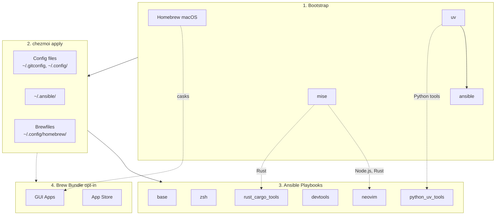

<!-- Generated by SpecStory, Markdown v2.1.0 -->

# 2026-02-06 08:32:17Z

<!-- Codex CLI Session 019c3214-9ba7-7361-a13e-d87c7909e82d (2026-02-06 08:32:17Z) -->

_**User (2026-02-06 08:32:17Z)**_


我希望添加codexbar

```
GitHub Releases
Download: https://github.com/steipete/CodexBar/releases

Homebrew
brew install --cask steipete/tap/codexbar
Linux (CLI only)
brew install steipete/tap/codexbar
```

macOS 用 Homebrew
Linux 優先用 Linuxbrew
如果失敗fallback to GitHub release


---

_**Agent (gpt-5.2-codex 2026-02-06 08:32:21Z)**_

<think><details><summary>Thought Process</summary>
**Exploring repo for plan mode**
</details></think>

_**Agent (gpt-5.2-codex 2026-02-06 08:32:22Z)**_

<tool-use data-tool-type="unknown" data-tool-name="exec_command"><details>
<summary>Tool use: **exec_command**</summary>
```
Chunk ID: 7159dd
Wall time: 0.0524 seconds
Process exited with code 0
Original token count: 46
Output:
.chezmoi.toml.tmpl
README.md
Dockerfile
dot_config/nvim/README.md
dot_config/homebrew/Brewfile.darwin.tmpl
dot_config/homebrew/Brewfile.linux.tmpl
dot_config/homebrew/Brewfile.tmpl
```
</details></tool-use>

_**Agent (gpt-5.2-codex 2026-02-06 08:32:26Z)**_

<tool-use data-tool-type="unknown" data-tool-name="exec_command"><details>
<summary>Tool use: **exec_command**</summary>
```
Chunk ID: d3299d
Wall time: 0.0520 seconds
Process exited with code 1
Original token count: 0
Output:
```
</details></tool-use>

_**Agent (gpt-5.2-codex 2026-02-06 08:32:30Z)**_

<think><details><summary>Thought Process</summary>
**No code matches found**
</details></think>

_**Agent (gpt-5.2-codex 2026-02-06 08:32:30Z)**_

<tool-use data-tool-type="unknown" data-tool-name="exec_command"><details>
<summary>Tool use: **exec_command**</summary>
```
Chunk ID: e885ac
Wall time: 0.0515 seconds
Process exited with code 0
Original token count: 1201
Output:
# dotfiles

Cross-platform development environment setup using **chezmoi** + **ansible**.

- **chezmoi**: manages config files (dotfiles)
- **ansible**: installs system dependencies and tools

## Prerequisites

- [chezmoi](https://www.chezmoi.io/install/)
- [uv](https://docs.astral.sh/uv/getting-started/installation/) (for ansible)

## Architecture



## Quick Setup

```bash
# One-liner to initialize and apply (installs chezmoi to ~/.local/bin)
export GITHUB_USERNAME=daviddwlee84
sh -c "$(curl -fsLS get.chezmoi.io/lb)" -- init --apply git@github.com:$GITHUB_USERNAME/dotfiles.git
```

This automatically:

1. Bootstraps Homebrew (macOS/Linux), uv, mise, ansible
2. Deploys all config files
3. Runs ansible playbooks (git, ripgrep, fd, neovim, etc.)
4. Runs brew bundle (if `installBrewApps` enabled)

### Optional Components

During `chezmoi init`, you'll be prompted for optional installs:

| Option | Default | Description |
|--------|---------|-------------|
| `installCodingAgents` | true | Claude Code, OpenCode, Cursor, Copilot, Gemini CLI, etc. |
| `installPythonUvTools` | true | Python CLI tools via uv (mlflow, litellm, sqlit-tui, etc.) |
| `installBrewApps` | false | GUI apps via Homebrew Brewfile (casks, mas) |
| `noRoot` | false | Skip sudo-requiring tasks (for servers without root access) |

To change options later: `chezmoi init --force`

## What You Get

### Config Files

- `~/.gitconfig` - Git configuration
- `~/.config/nvim/` - Neovim (LazyVim) configuration
- `~/.config/uv/uv.toml` - uv package manager config
- `~/.config/alacritty/` - Alacritty terminal config
- `~/.claude/` - Claude Code settings
- `~/.tmux.conf` - Tmux configuration with TPM plugins
- `~/.config/homebrew/` - Brewfiles for GUI apps (macOS casks + mas)

### Tools (via ansible)

- **Base**: git, curl, ripgrep, fd, just, build tools
- **Neovim**: >= 0.11.2 with LazyVim dependencies
- **LazyVim deps**: fzf, lazygit, tree-sitter-cli, Node.js
- **Coding Agents** (optional): Claude Code, OpenCode, Cursor CLI, Copilot CLI, Gemini CLI, SpecStory, Happy
- **Docker**: OrbStack (macOS) or Docker Engine (Linux)
- **Cargo tools**: pueue (process queue manager)
- **GUI Apps** (macOS): terminals, editors, browsers, utilities via Brewfile

### Bootstrap (installed before ansible)
- **Homebrew** (macOS): Package manager for macOS
- **uv**: Python package manager for ansible
- **mise**: Runtime manager for Node.js and Rust (ensures latest versions)
- **Dev tools**: bat, eza, git-delta, tldr, thefuck, zoxide, direnv, yazi, tmux+tpm, zellij, btop, htop
- **NerdFonts**: Hack Nerd Font for terminal emulators

## Supported Platforms

| Platform | Package Manager | Notes |
|----------|-----------------|-------|
| macOS | Homebrew | Full support |
| Ubuntu Desktop | apt + snap | Full support |
| Ubuntu Server | apt + snap | Full support |
| Ubuntu Server (no root) | GitHub binaries + mise + cargo + uv | `noRoot=true`, tools installed to `~/.local/bin` |

## Manual Commands

```bash
chezmoi diff          # Preview changes
chezmoi apply         # Apply config files
chezmoi cd            # Go to source directory

# Re-run ansible manually
cd ~/.ansible && ansible-playbook playbooks/macos.yml
```

## Docker Testing

Test the full dotfiles setup on a bare Ubuntu machine:

```bash
# Build and run test suite
just docker-test

# Interactive devbox shell
just docker-run

# Build specific profiles
just docker-desktop    # Ubuntu desktop profile
just docker-china      # China mirror profile
```

## Development with justfile

This project uses [just](https://github.com/casey/just) as a command runner:

```bash
just                  # List all commands
just lint             # Ansible syntax check
just check            # Full lint + dry-run
just docker-build     # Build Docker image
just info             # Show system info
```

## Customization

See [CLAUDE.md](CLAUDE.md) for development guide and [docs/ansible.md](docs/ansible.md) for ansible customization.
```
</details></tool-use>

_**Agent (gpt-5.2-codex 2026-02-06 08:32:35Z)**_

<tool-use data-tool-type="unknown" data-tool-name="exec_command"><details>
<summary>Tool use: **exec_command**</summary>
```
Chunk ID: b187cd
Wall time: 0.0516 seconds
Process exited with code 0
Original token count: 463
Output:
# https://www.chezmoi.io/reference/special-files/chezmoi-format-tmpl/

[data]
# 只在 init 才需要問一次：你之後都讀這個值
# 這裡用 promptString：沒有值就會問使用者，輸入後寫進 config
# TODO: not all the things we want to change all the time we chezmoi init
profile = {{ promptString "profile (ubuntu_server|ubuntu_desktop|macos)" "macos" | quote }}
email   = {{ promptStringOnce . "email" "What is your email address" "daviddwlee84@gmail.com" | quote }}
name    = {{ promptStringOnce . "name" "What is your full name" "Da-Wei Lee" | quote }}
# 是否在中國大陸 GFW 內，需要使用鏡像源
useChineseMirror = {{ promptBoolOnce . "useChineseMirror" "Are you in China (behind GFW) and need to use mirrors" false }}
# 是否對所有 repo 啟用 gitleaks 掃描（包含沒有 .pre-commit-config.yaml 的 repo）
gitleaksAllRepos = {{ promptBoolOnce . "gitleaksAllRepos" "Enable gitleaks for ALL git repos (not just those with .pre-commit-config.yaml)" false }}
# 是否安裝 coding agents (Claude Code, OpenCode, Cursor, Copilot, Gemini, etc.)
installCodingAgents = {{ promptBoolOnce . "installCodingAgents" "Install coding agents (Claude Code, OpenCode, Cursor, Copilot, Gemini, etc.)" true }}
# 是否安裝 Python CLI tools via uv (mlflow, litellm, sqlit-tui, etc.)
installPythonUvTools = {{ promptBoolOnce . "installPythonUvTools" "Install Python CLI tools via uv (mlflow, litellm, sqlit-tui, etc.)" true }}
# 是否安裝 GUI apps via Homebrew Brewfile (terminals, browsers, utilities, etc.)
installBrewApps = {{ promptBoolOnce . "installBrewApps" "Install GUI apps via Homebrew Brewfile (casks, mas)" false }}
# 沒有 sudo/root 權限，只安裝 user-level 工具 (mise, cargo, gem, uv, npm)
noRoot = {{ promptBoolOnce . "noRoot" "No sudo/root access - skip all system package installations" false }}
```
</details></tool-use>

_**Agent (gpt-5.2-codex 2026-02-06 08:32:40Z)**_

<think><details><summary>Thought Process</summary>
**Noting Brewfile requirement**
</details></think>

_**Agent (gpt-5.2-codex 2026-02-06 08:32:40Z)**_

<tool-use data-tool-type="unknown" data-tool-name="exec_command"><details>
<summary>Tool use: **exec_command**</summary>
```
Chunk ID: 67b79c
Wall time: 0.0517 seconds
Process exited with code 0
Original token count: 238
Output:
# Brewfile - Shared configuration (macOS & Linux)
# Applied via: brew bundle --file=~/.config/homebrew/Brewfile
#
# This file is managed by chezmoi. Edit the source:
#   chezmoi edit ~/.config/homebrew/Brewfile

# =============================================================================
# Taps (Third-party repositories)
# =============================================================================
tap "nikitabobko/tap"  # aerospace (macOS window manager)
tap "superset-sh/superset"

# =============================================================================
# Formulas - CLI Tools (cross-platform)
# =============================================================================
# Note: Most CLI tools are managed by ansible for better cross-platform support
# Only add formulas here that you want to manage via Brewfile

# Mac App Store CLI (needed for mas entries in Brewfile.darwin)
{{ if eq .profile "macos" -}}
brew "mas"
{{ end -}}
```
</details></tool-use>

_**Agent (gpt-5.2-codex 2026-02-06 08:32:44Z)**_

<tool-use data-tool-type="unknown" data-tool-name="exec_command"><details>
<summary>Tool use: **exec_command**</summary>
```
Chunk ID: 83e3af
Wall time: 0.0521 seconds
Process exited with code 0
Original token count: 1452
Output:
# Brewfile.darwin - macOS GUI applications (casks) and Mac App Store apps
# Applied via: brew bundle --file=~/.config/homebrew/Brewfile.darwin
#
# This file is managed by chezmoi. Edit the source:
#   chezmoi edit ~/.config/homebrew/Brewfile.darwin

# =============================================================================
# Casks - Terminals & Editors
# =============================================================================
cask "alacritty"
# cask "iterm2"
cask "warp"
cask "cursor"
cask "visual-studio-code"

# =============================================================================
# Casks - AI & Coding Assistants
# =============================================================================
cask "claude"
cask "chatgpt"
# cask "chatgpt-atlas"  # Uncomment if needed
cask "ollama"
# cask "termius"          # SSH client

# =============================================================================
# Casks - System Utilities
# =============================================================================
cask "nikitabobko/tap/aerospace"  # Tiling window manager
cask "alt-tab"                     # Windows-style alt-tab
cask "raycast"                     # Spotlight replacement
# cask "itsycal"                     # Menu bar calendar
# cask "jordanbaird-ice"             # Menu bar manager (Ice.app)
cask "scroll-reverser"             # Reverse scroll direction per device
# cask "sloth"                       # Process/file viewer
cask "the-unarchiver"              # Archive extraction
cask "applite"                     # GUI for Homebrew casks

# =============================================================================
# Casks - Communication
# =============================================================================
# cask "discord"  # Commented out - install manually from discord.com
# cask "messenger"
# cask "telegram"
# cask "wechat"   # We used to install WeChat using Apple Store (TODO: maybe use mas?! but that would need login...)
# cask "whatsapp"
# cask "dingtalk"
# cask "tencent-meeting"  # TencentMeeting.app

# =============================================================================
# Casks - Browsers
# =============================================================================
cask "arc"
# cask "google-chrome"
# cask "tor-browser"

# =============================================================================
# Casks - Productivity
# =============================================================================
cask "obsidian"
cask "google-drive"
cask "grammarly-desktop"
# cask "readest"              # E-book reader
cask "super-productivity"   # Task/time management
# cask "wispr-flow"           # Voice typing
# cask "mathpix-snipping-tool"

# =============================================================================
# Casks - Media & Entertainment
# =============================================================================
cask "spotify"
cask "anki"

# =============================================================================
# Casks - Gaming (skip on work machines)
# =============================================================================
# {{ if not (env "WORK_MACHINE") -}}
# cask "steam"
# cask "minecraft"
# cask "battle-net"
# cask "hstracker"  # Hearthstone deck tracker
# {{- end }}

# =============================================================================
# Casks - Finance & Trading
# =============================================================================
# cask "binance"
# cask "tradingview"

# =============================================================================
# Casks - Network & VPN
# =============================================================================
# cask "tailscale"
# cask "openvpn-connect"
# cask "vibetunnel"
# cask "clash-verge-rev"  # Clash proxy GUI (replacement for Clash for Windows)

# =============================================================================
# Casks - Virtualization & Remote
# =============================================================================
# cask "virtualbox"
# cask "windows-app"      # Microsoft Remote Desktop
# cask "teamviewer-host"
# cask "sharemouse"       # KVM software

# =============================================================================
# Casks - Developer Tools
# =============================================================================
# Note: docker/orbstack is managed by ansible docker role
cask "dbeaver-community"
cask "superset-sh/superset/superset"

# =============================================================================
# Casks - Cloud Storage (Chinese apps)
# =============================================================================
# {{ if .useChineseMirror -}}
# cask "baidunetdisk"  # Baidu Netdisk (百度网盘)
# {{- end }}

# =============================================================================
# Mac App Store Apps
... (truncated)
```
</details></tool-use>

_**Agent (gpt-5.2-codex 2026-02-06 08:32:47Z)**_

<tool-use data-tool-type="unknown" data-tool-name="exec_command"><details>
<summary>Tool use: **exec_command**</summary>
```
Chunk ID: 5dbbd0
Wall time: 0.0512 seconds
Process exited with code 0
Original token count: 357
Output:
# Brewfile.linux - Linux-specific Homebrew (Linuxbrew) packages
# Applied via: brew bundle --file=~/.config/homebrew/Brewfile.linux
#
# This file is managed by chezmoi. Edit the source:
#   chezmoi edit ~/.config/homebrew/Brewfile.linux
#
# Note: Most packages on Linux are managed by apt/ansible.
# This file is for Linuxbrew-specific additions that aren't easily
# available via apt or provide better/newer versions.

# =============================================================================
# Formulas - CLI tools better installed via Linuxbrew
# =============================================================================
# Uncomment as needed - most are already handled by ansible

# brew "gh"           # GitHub CLI (newer version than apt)
# brew "bat"          # Better cat with syntax highlighting
# brew "eza"          # Modern ls replacement
# brew "fd"           # Better find
# brew "ripgrep"      # Better grep
# brew "fzf"          # Fuzzy finder
# brew "lazygit"      # Terminal UI for git

# =============================================================================
# Linux-compatible casks (limited availability)
# =============================================================================
# Note: Most casks are macOS-only. Only fonts and a few tools work on Linux.

# Fonts (if you prefer Homebrew over manual install)
# cask "font-hack-nerd-font"  # Already managed by ansible nerdfonts role
```
</details></tool-use>

_**Agent (gpt-5.2-codex 2026-02-06 08:32:53Z)**_

<think><details><summary>Thought Process</summary>
**Noting need for Dockerfile**
</details></think>

_**Agent (gpt-5.2-codex 2026-02-06 08:32:53Z)**_

<tool-use data-tool-type="unknown" data-tool-name="exec_command"><details>
<summary>Tool use: **exec_command**</summary>
```
Chunk ID: 43d71b
Wall time: 0.0516 seconds
Process exited with code 0
Original token count: 1384
Output:
# Dotfiles test/devbox container
# Build: docker build -t dotfiles .
# Run:   docker run -it dotfiles

FROM ubuntu:24.04

# Build arguments for chezmoi configuration
ARG CHEZMOI_PROFILE=ubuntu_server
ARG CHEZMOI_EMAIL=docker@example.com
ARG CHEZMOI_NAME="Docker User"
ARG CHEZMOI_USE_CHINESE_MIRROR=false
ARG CHEZMOI_GITLEAKS_ALL_REPOS=false
ARG CHEZMOI_INSTALL_CODING_AGENTS=false
ARG CHEZMOI_INSTALL_PYTHON_UV_TOOLS=false
ARG CHEZMOI_INSTALL_BREW_APPS=false
ARG CHEZMOI_NO_ROOT=false
ARG CHEZMOI_REPO=daviddwlee84

# Avoid interactive prompts during apt install
ENV DEBIAN_FRONTEND=noninteractive

# Configure HTTP mirror BEFORE installing ca-certificates (if in China)
# This solves the chicken-and-egg problem: HTTPS mirrors need ca-certificates,
# but installing ca-certificates from default repos fails under GFW
# Uses HTTP (not HTTPS) since ca-certificates isn't installed yet
RUN if [ "${CHEZMOI_USE_CHINESE_MIRROR}" = "true" ]; then \
        ARCH=$(dpkg --print-architecture) && \
        if [ "$ARCH" = "amd64" ]; then \
            MIRROR_URL="http://repo.huaweicloud.com/ubuntu"; \
        else \
            MIRROR_URL="http://repo.huaweicloud.com/ubuntu-ports"; \
        fi && \
        printf '%s\n' \
            "Types: deb" \
            "URIs: ${MIRROR_URL}" \
            "Suites: noble noble-updates noble-backports" \
            "Components: main restricted universe multiverse" \
            "Signed-By: /usr/share/keyrings/ubuntu-archive-keyring.gpg" \
            "" \
            "Types: deb" \
            "URIs: ${MIRROR_URL}" \
            "Suites: noble-security" \
            "Components: main restricted universe multiverse" \
            "Signed-By: /usr/share/keyrings/ubuntu-archive-keyring.gpg" \
            > /etc/apt/sources.list.d/ubuntu.sources; \
    fi

# Install ca-certificates (now using HTTP mirror if in China, default repos otherwise)
RUN apt-get update && apt-get install -y --no-install-recommends ca-certificates \
    && rm -rf /var/lib/apt/lists/*

# Upgrade to HTTPS mirror after ca-certificates is installed (if in China)
# HTTPS is more secure for subsequent package installations
RUN if [ "${CHEZMOI_USE_CHINESE_MIRROR}" = "true" ]; then \
        ARCH=$(dpkg --print-architecture) && \
        if [ "$ARCH" = "amd64" ]; then \
            MIRROR_URL="https://repo.huaweicloud.com/ubuntu"; \
        else \
            MIRROR_URL="https://repo.huaweicloud.com/ubuntu-ports"; \
        fi && \
        printf '%s\n' \
            "Types: deb" \
            "URIs: ${MIRROR_URL}" \
            "Suites: noble noble-updates noble-backports" \
            "Components: main restricted universe multiverse" \
            "Signed-By: /usr/share/keyrings/ubuntu-archive-keyring.gpg" \
            "" \
            "Types: deb" \
            "URIs: ${MIRROR_URL}" \
            "Suites: noble-security" \
            "Components: main restricted universe multiverse" \
            "Signed-By: /usr/share/keyrings/ubuntu-archive-keyring.gpg" \
            > /etc/apt/sources.list.d/ubuntu.sources; \
    fi

# Install minimal dependencies
# python3 is required for ansible to run modules on localhost
RUN apt-get update && apt-get install -y --no-install-recommends \
    curl \
    sudo \
    git \
    python3 \
    && rm -rf /var/lib/apt/lists/*

# Create non-root user with sudo access
RUN useradd -m -s /bin/bash devuser \
    && echo "devuser ALL=(ALL) NOPASSWD:ALL" >> /etc/sudoers.d/devuser \
    && chmod 0440 /etc/sudoers.d/devuser

# Copy local dotfiles source into image
# This allows testing local changes without pushing to GitHub
COPY --chown=devuser:devuser . /tmp/dotfiles-source

# Switch to non-root user
USER devuser
WORKDIR /home/devuser

# Install chezmoi binary
# Retry up to 3 times to handle network issues (especially behind GFW)
RUN for i in 1 2 3; do \
        echo "Attempt $i: Installing chezmoi to ~/.local/bin..." && \
        sh -c "$(curl -fsLS --retry 3 --retry-delay 5 get.chezmoi.io/lb)" && \
        echo "chezmoi installed successfully" && break || \
        { echo "Attempt $i failed, retrying..."; sleep 10; }; \
    done

# Initialize and apply dotfiles with prompt values passed via flags
# This avoids interactive prompts during Docker build
# Set PATH to include ~/.local/bin so run_once scripts can find uv tools (ansible)
# Use local source instead of cloning from GitHub to test local changes
# Note: installBrewApps=false by default (Linuxbrew is optional on Linux)
RUN export PATH="$HOME/.local/bin:$PATH" && \
    ~/.local/bin/chezmoi init --apply --source=/tmp/dotfiles-source \
    --promptString "profile (ubuntu_server|ubuntu_desktop|macos)=${CHEZMOI_PROFILE}" \
    --promptString "What is your email address=${CHEZMOI_EMAIL}" \
    --promptString "What is your full name=${CHEZMOI_NAME}" \
    --promptBool "Are you in China (behind GFW) and need to use mirrors=${CHEZMOI_USE_CHINESE_
... (truncated)
```
</details></tool-use>

_**Agent (gpt-5.2-codex 2026-02-06 08:33:00Z)**_

<think><details><summary>Thought Process</summary>
**Exploring installation strategies**

I'm outlining a plan to add codexbar installation via Homebrew cask on macOS and Linuxbrew or fallback GitHub release on Linux, considering using or locating Ansible roles—especially searching for any existing coding_agents role to integrate this setup.
</details></think>

_**Agent (gpt-5.2-codex 2026-02-06 08:33:01Z)**_

<tool-use data-tool-type="unknown" data-tool-name="exec_command"><details>
<summary>Tool use: **exec_command**</summary>
```
Chunk ID: c532c8
Wall time: 0.0520 seconds
Process exited with code 0
Original token count: 3569
Output:
run_once_before_00_bootstrap.sh.tmpl:37:if [[ -f /opt/homebrew/bin/brew ]]; then
run_once_before_00_bootstrap.sh.tmpl:38:    eval "$(/opt/homebrew/bin/brew shellenv)"
run_once_before_00_bootstrap.sh.tmpl:44:if [[ -d /home/linuxbrew/.linuxbrew ]]; then
run_once_before_00_bootstrap.sh.tmpl:45:    eval "$(/home/linuxbrew/.linuxbrew/bin/brew shellenv)"
run_once_before_00_bootstrap.sh.tmpl:46:elif [[ -d "$HOME/.linuxbrew" ]]; then
run_once_before_00_bootstrap.sh.tmpl:47:    eval "$("$HOME/.linuxbrew/bin/brew" shellenv)"
run_once_before_00_bootstrap.sh.tmpl:64:    if [[ -f /opt/homebrew/bin/brew ]]; then
run_once_before_00_bootstrap.sh.tmpl:65:        eval "$(/opt/homebrew/bin/brew shellenv)"
run_once_before_00_bootstrap.sh.tmpl:90:    if [[ -d /home/linuxbrew/.linuxbrew ]]; then
run_once_before_00_bootstrap.sh.tmpl:91:        eval "$(/home/linuxbrew/.linuxbrew/bin/brew shellenv)"
run_once_before_00_bootstrap.sh.tmpl:92:    elif [[ -d "$HOME/.linuxbrew" ]]; then
run_once_before_00_bootstrap.sh.tmpl:93:        eval "$("$HOME/.linuxbrew/bin/brew" shellenv)"
run_onchange_after_20_ansible_roles.sh.tmpl:7:# homebrew: {{ include "dot_ansible/roles/homebrew/tasks/main.yml" | sha256sum }}
run_onchange_after_20_ansible_roles.sh.tmpl:18:# coding_agents tasks: {{ include "dot_ansible/roles/coding_agents/tasks/main.yml" | sha256sum }}
run_onchange_after_20_ansible_roles.sh.tmpl:19:# coding_agents defaults: {{ include "dot_ansible/roles/coding_agents/defaults/main.yml" | sha256sum }}
run_onchange_after_20_ansible_roles.sh.tmpl:48:#   macOS:   homebrew
run_onchange_after_20_ansible_roles.sh.tmpl:49:#   Optional: coding_agents, python_uv_tools, rust_cargo_tools, ruby_gem_tools
run_onchange_after_20_ansible_roles.sh.tmpl:54:TAGS="homebrew,base,zsh,neovim,lazyvim_deps,devtools,docker,nerdfonts,security_tools,rust_cargo_tools,ruby_gem_tools"
run_onchange_after_20_ansible_roles.sh.tmpl:57:# Ubuntu Desktop: full desktop experience (no homebrew)
run_onchange_after_20_ansible_roles.sh.tmpl:70:TAGS="${TAGS},coding_agents"
run_onchange_after_30_brew_bundle.sh.tmpl:2:# Run brew bundle when Brewfiles change
run_onchange_after_30_brew_bundle.sh.tmpl:14:# === Brewfile Hashes (changes trigger re-run) ===
run_onchange_after_30_brew_bundle.sh.tmpl:15:# Brewfile: {{ include "dot_config/homebrew/Brewfile.tmpl" | sha256sum }}
run_onchange_after_30_brew_bundle.sh.tmpl:16:# Brewfile.darwin: {{ include "dot_config/homebrew/Brewfile.darwin.tmpl" | sha256sum }}
run_onchange_after_30_brew_bundle.sh.tmpl:18:# === Brewfile Hashes (changes trigger re-run) ===
run_onchange_after_30_brew_bundle.sh.tmpl:19:# Brewfile: {{ include "dot_config/homebrew/Brewfile.tmpl" | sha256sum }}
run_onchange_after_30_brew_bundle.sh.tmpl:20:# Brewfile.linux: {{ include "dot_config/homebrew/Brewfile.linux.tmpl" | sha256sum }}
run_onchange_after_30_brew_bundle.sh.tmpl:39:if [[ -f /opt/homebrew/bin/brew ]]; then
run_onchange_after_30_brew_bundle.sh.tmpl:40:    eval "$(/opt/homebrew/bin/brew shellenv)"
run_onchange_after_30_brew_bundle.sh.tmpl:46:if [[ -d /home/linuxbrew/.linuxbrew ]]; then
run_onchange_after_30_brew_bundle.sh.tmpl:47:    eval "$(/home/linuxbrew/.linuxbrew/bin/brew shellenv)"
run_onchange_after_30_brew_bundle.sh.tmpl:48:elif [[ -d "$HOME/.linuxbrew" ]]; then
run_onchange_after_30_brew_bundle.sh.tmpl:49:    eval "$("$HOME/.linuxbrew/bin/brew" shellenv)"
run_onchange_after_30_brew_bundle.sh.tmpl:59:    warn "Homebrew (Linuxbrew) not installed. Skipping brew bundle."
run_onchange_after_30_brew_bundle.sh.tmpl:65:BREWFILE_DIR="$HOME/.config/homebrew"
run_onchange_after_30_brew_bundle.sh.tmpl:67:# Check if Brewfiles exist
run_onchange_after_30_brew_bundle.sh.tmpl:68:if [[ ! -f "$BREWFILE_DIR/Brewfile" ]]; then
run_onchange_after_30_brew_bundle.sh.tmpl:69:    warn "Brewfile not found at $BREWFILE_DIR/Brewfile"
run_onchange_after_30_brew_bundle.sh.tmpl:70:    warn "Run 'chezmoi apply' to deploy Brewfiles first."
run_onchange_after_30_brew_bundle.sh.tmpl:74:info "Running brew bundle..."
run_onchange_after_30_brew_bundle.sh.tmpl:76:# Run shared Brewfile first (installs mas, taps)
run_onchange_after_30_brew_bundle.sh.tmpl:77:info "Installing shared packages from Brewfile..."
run_onchange_after_30_brew_bundle.sh.tmpl:78:brew bundle --file="$BREWFILE_DIR/Brewfile" --no-upgrade || {
run_onchange_after_30_brew_bundle.sh.tmpl:79:    warn "Some packages in Brewfile failed to install (continuing...)"
run_onchange_after_30_brew_bundle.sh.tmpl:82:# Run platform-specific Brewfile
run_onchange_after_30_brew_bundle.sh.tmpl:84:if [[ -f "$BREWFILE_DIR/Brewfile.darwin" ]]; then
run_onchange_after_30_brew_bundle.sh.tmpl:85:    info "Installing macOS packages from Brewfile.darwin..."
run_onchange_after_30_brew_bundle.sh.tmpl:86:    brew bundle --file="$BREWFILE_DIR/Brewfile.darwin" --no-upgrade || {
run_onchange_after_30_brew_bundle.sh.tmpl:87:        warn "Some packages in Brewfile.darw
... (truncated)
```
</details></tool-use>

_**Agent (gpt-5.2-codex 2026-02-06 08:33:04Z)**_

<think><details><summary>Thought Process</summary>
**Identifying missing role**
</details></think>

_**Agent (gpt-5.2-codex 2026-02-06 08:33:04Z)**_

<tool-use data-tool-type="unknown" data-tool-name="exec_command"><details>
<summary>Tool use: **exec_command**</summary>
```
Chunk ID: 680951
Wall time: 0.0513 seconds
Process exited with code 0
Original token count: 12
Output:
---
# Default variables for coding_agents role
```
</details></tool-use>

_**Agent (gpt-5.2-codex 2026-02-06 08:33:08Z)**_

<tool-use data-tool-type="unknown" data-tool-name="exec_command"><details>
<summary>Tool use: **exec_command**</summary>
```
Chunk ID: 67b7a2
Wall time: 0.0521 seconds
Process exited with code 0
Original token count: 1808
Output:
---
# Coding Agents Installation
# Installs various AI coding assistants and companion tools
# All installations include idempotency checks to avoid slow reinstalls

# === Notification Tools (from claude_deps) ===

# macOS - terminal-notifier
- name: Install terminal-notifier (macOS)
  when: ansible_facts["os_family"] == "Darwin"
  community.general.homebrew:
    name: terminal-notifier
    state: present

# Linux - libnotify-bin (provides notify-send)
- name: Install libnotify-bin (Debian/Ubuntu)
  when: ansible_facts["os_family"] == "Debian"
  become: true
  tags: [sudo]
  ansible.builtin.apt:
    name: libnotify-bin
    state: present

# === Claude Code ===

- name: Check if Claude Code is installed (macOS)
  when: ansible_facts["os_family"] == "Darwin"
  ansible.builtin.command: which claude
  register: claude_macos_check
  changed_when: false
  failed_when: false

- name: Install Claude Code (macOS)
  when:
    - ansible_facts["os_family"] == "Darwin"
    - claude_macos_check.rc != 0
  community.general.homebrew_cask:
    name: claude-code
    state: present

- name: Check if Claude Code is installed (Linux)
  when: ansible_facts["os_family"] == "Debian"
  ansible.builtin.command: which claude
  register: claude_check
  changed_when: false
  failed_when: false

- name: Install Claude Code (Linux)
  when:
    - ansible_facts["os_family"] == "Debian"
    - claude_check.rc != 0
  ansible.builtin.shell: |
    curl -fsSL https://claude.ai/install.sh | bash
  args:
    creates: "{{ ansible_facts['env']['HOME'] }}/.claude/local/bin/claude"

# === OpenCode ===

- name: Check if OpenCode is installed (macOS)
  when: ansible_facts["os_family"] == "Darwin"
  ansible.builtin.command: which opencode
  register: opencode_macos_check
  changed_when: false
  failed_when: false

- name: Tap anomalyco/tap for OpenCode (macOS)
  when:
    - ansible_facts["os_family"] == "Darwin"
    - opencode_macos_check.rc != 0
  community.general.homebrew_tap:
    name: anomalyco/tap
    state: present

- name: Install OpenCode (macOS)
  when:
    - ansible_facts["os_family"] == "Darwin"
    - opencode_macos_check.rc != 0
  community.general.homebrew:
    name: opencode
    state: present

- name: Check if OpenCode is installed (Linux)
  when: ansible_facts["os_family"] == "Debian"
  ansible.builtin.command: which opencode
  register: opencode_check
  changed_when: false
  failed_when: false

- name: Install OpenCode (Linux)
  when:
    - ansible_facts["os_family"] == "Debian"
    - opencode_check.rc != 0
  ansible.builtin.shell: |
    curl -fsSL https://opencode.ai/install | bash
  args:
    creates: "{{ ansible_facts['env']['HOME'] }}/.opencode/bin/opencode"

# === Cursor CLI ===
# Note: cursor-cli cask provides `cursor-agent` and `agent` binaries, not `cursor`

- name: Check if Cursor CLI is installed (macOS)
  when: ansible_facts["os_family"] == "Darwin"
  ansible.builtin.command: which cursor-agent
  register: cursor_macos_check
  changed_when: false
  failed_when: false

- name: Install Cursor CLI (macOS)
  when:
    - ansible_facts["os_family"] == "Darwin"
    - cursor_macos_check.rc != 0
  community.general.homebrew_cask:
    name: cursor-cli
    state: present
  ignore_errors: true  # Network errors shouldn't fail the playbook

- name: Check if Cursor CLI is installed (Linux)
  when: ansible_facts["os_family"] == "Debian"
  ansible.builtin.command: which cursor-agent
  register: cursor_check
  changed_when: false
  failed_when: false

- name: Install Cursor CLI (Linux)
  when:
    - ansible_facts["os_family"] == "Debian"
    - cursor_check.rc != 0
  ansible.builtin.shell: |
    curl -fsSL https://cursor.com/install | bash
  args:
    creates: "{{ ansible_facts['env']['HOME'] }}/.local/bin/cursor-agent"
  ignore_errors: true

# === GitHub Copilot CLI ===

- name: Check if npm is available
  ansible.builtin.command: which npm
  register: npm_check
  changed_when: false
  failed_when: false

- name: Check if GitHub Copilot CLI is installed
  when: npm_check.rc == 0
  ansible.builtin.command: which github-copilot-cli
  register: copilot_check
  changed_when: false
  failed_when: false

- name: Install GitHub Copilot CLI (npm)
  when:
    - npm_check.rc == 0
    - copilot_check.rc != 0
  community.general.npm:
    name: "@githubnext/github-copilot-cli"
    global: true
    state: present
  ignore_errors: true

# === Gemini CLI ===

- name: Check if Gemini CLI is installed (macOS)
  when: ansible_facts["os_family"] == "Darwin"
  ansible.builtin.command: which gemini
  register: gemini_macos_check
  changed_when: false
  failed_when: false

- name: Install Gemini CLI (macOS)
  when:
    - ansible_facts["os_family"] == "Darwin"
    - gemini_macos_check.rc != 0
  community.general.homebrew:
    name: gemini-cli
    state: present

- name: Check if Gemini CLI is installed (Linux)
  when:
    - ansible_facts["os_family"] == "Debian"

... (truncated)
```
</details></tool-use>

_**Agent (gpt-5.2-codex 2026-02-06 08:33:32Z)**_

<think><details><summary>Thought Process</summary>
**Planning cross-platform install of GUI tool**

CodexBar is a macOS GUI app, so on macOS it fits as a Homebrew cask install. For Linux, the preferred install is via Linuxbrew formula, falling back to a GitHub release download if brew is unavailable. The best approach is adding this logic to the coding_agents role, using brew directly for macOS and checking for brew on Linux before falling back to a URL fetch. Next, I'll review coding_agents tasks and existing Linuxbrew detection or fallback patterns to align the implementation.
</details></think>

_**Agent (gpt-5.2-codex 2026-02-06 08:33:32Z)**_

<think><details><summary>Thought Process</summary>
**Planning GitHub fallback and README updates**

I'm planning to implement Linux fallback by fetching the latest GitHub release asset matching Linux x86_64, using Ansible's URI or get_url modules with logic to parse the release JSON. I'll propose adding CodexBar to the coding_agents role as an optional tool and updating the README's Tools section accordingly. I also plan to confirm installation paths and binary names with the user and check existing roles for similar GitHub release fallback patterns.
</details></think>

_**Agent (gpt-5.2-codex 2026-02-06 08:33:32Z)**_

<tool-use data-tool-type="unknown" data-tool-name="exec_command"><details>
<summary>Tool use: **exec_command**</summary>
```
Chunk ID: 575f17
Wall time: 0.0519 seconds
Process exited with code 0
Original token count: 1526
Output:
dot_ansible/roles/base/tasks/main.yml:54:- name: Install ripgrep from GitHub releases (user-level, no sudo)
dot_ansible/roles/base/tasks/main.yml:67:        url: https://api.github.com/repos/BurntSushi/ripgrep/releases/latest
dot_ansible/roles/base/tasks/main.yml:72:      ansible.builtin.get_url:
dot_ansible/roles/base/tasks/main.yml:106:- name: Install fd from GitHub releases (user-level, no sudo)
dot_ansible/roles/base/tasks/main.yml:119:        url: https://api.github.com/repos/sharkdp/fd/releases/latest
dot_ansible/roles/base/tasks/main.yml:124:      ansible.builtin.get_url:
dot_ansible/roles/base/tasks/main.yml:158:- name: Install jq from GitHub releases (user-level, no sudo)
dot_ansible/roles/base/tasks/main.yml:170:      ansible.builtin.get_url:
dot_ansible/roles/base/tasks/main.yml:171:        url: "https://github.com/jqlang/jq/releases/latest/download/jq-linux-{{ ansible_facts['architecture'] | replace('x86_64', 'amd64') | replace('aarch64', 'arm64') }}"
dot_ansible/roles/neovim/tasks/main.yml:69:- name: Install Neovim from GitHub releases if snap unavailable
dot_ansible/roles/neovim/tasks/main.yml:85:        url: https://api.github.com/repos/neovim/neovim/releases/latest
dot_ansible/roles/neovim/tasks/main.yml:90:      ansible.builtin.get_url:
dot_ansible/roles/neovim/tasks/main.yml:122:        msg: "Installed Neovim {{ nvim_release.json.tag_name }} from GitHub releases"
dot_ansible/roles/neovim/tasks/main.yml:145:      ansible.builtin.get_url:
dot_ansible/roles/lazyvim_deps/tasks/main.yml:98:- name: Install lazygit from GitHub releases (system-level)
dot_ansible/roles/lazyvim_deps/tasks/main.yml:108:        url: https://api.github.com/repos/jesseduffield/lazygit/releases/latest
dot_ansible/roles/lazyvim_deps/tasks/main.yml:113:      ansible.builtin.get_url:
dot_ansible/roles/lazyvim_deps/tasks/main.yml:139:- name: Install lazygit from GitHub releases (user-level, no sudo)
dot_ansible/roles/lazyvim_deps/tasks/main.yml:146:        url: https://api.github.com/repos/jesseduffield/lazygit/releases/latest
dot_ansible/roles/lazyvim_deps/tasks/main.yml:157:      ansible.builtin.get_url:
dot_ansible/roles/security_tools/tasks/main.yml:52:    url: https://api.github.com/repos/gitleaks/gitleaks/releases/latest
dot_ansible/roles/security_tools/tasks/main.yml:69:      ansible.builtin.get_url:
dot_ansible/roles/security_tools/tasks/main.yml:105:- name: Install gitleaks from GitHub releases (user-level, no sudo)
dot_ansible/roles/security_tools/tasks/main.yml:118:        url: https://api.github.com/repos/gitleaks/gitleaks/releases/latest
dot_ansible/roles/security_tools/tasks/main.yml:128:      ansible.builtin.get_url:
dot_ansible/roles/ruby_gem_tools/tasks/main.yml:66:  ansible.builtin.get_url:
dot_ansible/roles/nerdfonts/tasks/main.yml:22:# Linux - download from GitHub releases
dot_ansible/roles/nerdfonts/tasks/main.yml:50:      ansible.builtin.get_url:
dot_ansible/roles/nerdfonts/tasks/main.yml:51:        url: "https://github.com/ryanoasis/nerd-fonts/releases/latest/download/Hack.zip"
dot_ansible/roles/coding_agents/tasks/main.yml:233:    url: https://api.github.com/repos/specstoryai/specstory/releases/latest
dot_ansible/roles/coding_agents/tasks/main.yml:237:- name: Install SpecStory from GitHub release (Linux)
dot_ansible/roles/coding_agents/tasks/main.yml:242:  ansible.builtin.get_url:
dot_ansible/roles/devtools/tasks/main.yml:58:- name: Install bat from GitHub releases (user-level, no sudo)
dot_ansible/roles/devtools/tasks/main.yml:71:        url: https://api.github.com/repos/sharkdp/bat/releases/latest
dot_ansible/roles/devtools/tasks/main.yml:76:      ansible.builtin.get_url:
dot_ansible/roles/devtools/tasks/main.yml:161:- name: Install eza from GitHub releases (user-level, no sudo)
dot_ansible/roles/devtools/tasks/main.yml:174:        url: https://api.github.com/repos/eza-community/eza/releases/latest
dot_ansible/roles/devtools/tasks/main.yml:179:      ansible.builtin.get_url:
dot_ansible/roles/devtools/tasks/main.yml:203:- name: Install git-delta from GitHub releases (Debian/Ubuntu)
dot_ansible/roles/devtools/tasks/main.yml:212:        url: https://api.github.com/repos/dandavison/delta/releases/latest
dot_ansible/roles/devtools/tasks/main.yml:217:      ansible.builtin.get_url:
dot_ansible/roles/devtools/tasks/main.yml:239:- name: Install git-delta from GitHub releases (user-level, no sudo)
dot_ansible/roles/devtools/tasks/main.yml:252:        url: https://api.github.com/repos/dandavison/delta/releases/latest
dot_ansible/roles/devtools/tasks/main.yml:257:      ansible.builtin.get_url:
dot_ansible/roles/devtools/tasks/main.yml:350:- name: Install yazi from GitHub releases (Debian/Ubuntu)
dot_ansible/roles/devtools/tasks/main.yml:359:        url: https://api.github.com/repos/sxyazi/yazi/releases/latest
dot_ansible/roles/devtools/tasks/main.yml:364:      ansible.builtin.get_url:
dot_ansible/roles/devt
... (truncated)
```
</details></tool-use>

_**Agent (gpt-5.2-codex 2026-02-06 08:33:36Z)**_

<think><details><summary>Thought Process</summary>
**Checking GitHub release install patterns**
</details></think>

_**Agent (gpt-5.2-codex 2026-02-06 08:33:37Z)**_

<tool-use data-tool-type="unknown" data-tool-name="exec_command"><details>
<summary>Tool use: **exec_command**</summary>
```
Chunk ID: af70ac
Wall time: 0.0524 seconds
Process exited with code 0
Original token count: 846
Output:
  ansible.builtin.file:
    src: /usr/bin/fdfind
    dest: /usr/bin/fd
    state: link
  ignore_errors: true

# --- ripgrep (user-level fallback) ---
- name: Re-check if ripgrep is installed
  when: ansible_facts["os_family"] == "Debian"
  ansible.builtin.shell: command -v rg
  register: rg_recheck
  changed_when: false
  failed_when: false

- name: Install ripgrep from GitHub releases (user-level, no sudo)
  when:
    - ansible_facts["os_family"] == "Debian"
    - rg_recheck.rc != 0
  block:
    - name: Ensure ~/.local/bin exists (ripgrep)
      ansible.builtin.file:
        path: "{{ ansible_facts['env']['HOME'] }}/.local/bin"
        state: directory
        mode: '0755'

    - name: Get latest ripgrep release
      ansible.builtin.uri:
        url: https://api.github.com/repos/BurntSushi/ripgrep/releases/latest
        return_content: true
      register: rg_release

    - name: Download ripgrep binary
      ansible.builtin.get_url:
        url: "https://github.com/BurntSushi/ripgrep/releases/download/{{ rg_release.json.tag_name }}/ripgrep-{{ rg_release.json.tag_name }}-{{ ansible_facts['architecture'] }}-unknown-linux-musl.tar.gz"
        dest: /tmp/ripgrep.tar.gz
        mode: '0644'

    - name: Extract ripgrep
      ansible.builtin.unarchive:
        src: /tmp/ripgrep.tar.gz
        dest: /tmp
        remote_src: true

    - name: Install ripgrep to ~/.local/bin
      ansible.builtin.copy:
        src: "/tmp/ripgrep-{{ rg_release.json.tag_name }}-{{ ansible_facts['architecture'] }}-unknown-linux-musl/rg"
        dest: "{{ ansible_facts['env']['HOME'] }}/.local/bin/rg"
        mode: '0755'
        remote_src: true

    - name: Clean up ripgrep temp files
      ansible.builtin.file:
        path: "{{ item }}"
        state: absent
      loop:
        - /tmp/ripgrep.tar.gz
        - "/tmp/ripgrep-{{ rg_release.json.tag_name }}-{{ ansible_facts['architecture'] }}-unknown-linux-musl"

# --- fd (user-level fallback) ---
- name: Re-check if fd is installed
  when: ansible_facts["os_family"] == "Debian"
  ansible.builtin.shell: command -v fd
  register: fd_recheck
  changed_when: false
  failed_when: false

- name: Install fd from GitHub releases (user-level, no sudo)
  when:
    - ansible_facts["os_family"] == "Debian"
    - fd_recheck.rc != 0
  block:
    - name: Ensure ~/.local/bin exists (fd)
      ansible.builtin.file:
        path: "{{ ansible_facts['env']['HOME'] }}/.local/bin"
        state: directory
        mode: '0755'

    - name: Get latest fd release
      ansible.builtin.uri:
        url: https://api.github.com/repos/sharkdp/fd/releases/latest
        return_content: true
      register: fd_release

    - name: Download fd binary
      ansible.builtin.get_url:
        url: "https://github.com/sharkdp/fd/releases/download/{{ fd_release.json.tag_name }}/fd-{{ fd_release.json.tag_name }}-{{ ansible_facts['architecture'] }}-unknown-linux-gnu.tar.gz"
        dest: /tmp/fd.tar.gz
        mode: '0644'

    - name: Extract fd
      ansible.builtin.unarchive:
        src: /tmp/fd.tar.gz
        dest: /tmp
        remote_src: true

    - name: Install fd to ~/.local/bin
      ansible.builtin.copy:
        src: "/tmp/fd-{{ fd_release.json.tag_name }}-{{ ansible_facts['architecture'] }}-unknown-linux-gnu/fd"
        dest: "{{ ansible_facts['env']['HOME'] }}/.local/bin/fd"
        mode: '0755'
        remote_src: true
```
</details></tool-use>

_**Agent (gpt-5.2-codex 2026-02-06 08:33:42Z)**_

<think><details><summary>Thought Process</summary>
**Checking asset format for release**

I'm verifying the asset format for CodexBar by reviewing coding_agents specstory tasks to see if it uses a similar direct binary download approach.
</details></think>

_**Agent (gpt-5.2-codex 2026-02-06 08:33:43Z)**_

<tool-use data-tool-type="unknown" data-tool-name="exec_command"><details>
<summary>Tool use: **exec_command**</summary>
```
Chunk ID: fa14d9
Wall time: 0.0524 seconds
Process exited with code 0
Original token count: 324
Output:

- name: Check if SpecStory is installed (Linux)
  when: ansible_facts["os_family"] == "Debian"
  ansible.builtin.command: which specstory
  register: specstory_check
  changed_when: false
  failed_when: false

- name: Get latest SpecStory release version (Linux)
  when:
    - ansible_facts["os_family"] == "Debian"
    - specstory_check.rc != 0
  ansible.builtin.uri:
    url: https://api.github.com/repos/specstoryai/specstory/releases/latest
    return_content: true
  register: specstory_release

- name: Install SpecStory from GitHub release (Linux)
  when:
    - ansible_facts["os_family"] == "Debian"
    - specstory_check.rc != 0
    - specstory_release is defined
  ansible.builtin.get_url:
    url: "https://github.com/specstoryai/specstory/releases/download/{{ specstory_release.json.tag_name }}/specstory-linux-x86_64"
    dest: "{{ ansible_facts['env']['HOME'] }}/.local/bin/specstory"
    mode: "0755"

# === Happy ===

- name: Check if Happy is installed
  when: npm_check.rc == 0
  ansible.builtin.command: which happy
  register: happy_check
  changed_when: false
  failed_when: false

- name: Install Happy (npm)
  when:
    - npm_check.rc == 0
    - happy_check.rc != 0
  community.general.npm:
    name: happy-coder
    global: true
    state: present
  ignore_errors: true
```
</details></tool-use>

_**Agent (gpt-5.2-codex 2026-02-06 08:34:08Z)**_

<think><details><summary>Thought Process</summary>
**Planning CodexBar installation strategy**

I'm outlining adding CodexBar to coding_agents via Ansible with checks for macOS (homebrew_cask with tap) and Linux (homebrew tap and formula), toggled by installCodingAgents. I'll implement a fallback on Linux from Homebrew to GitHub releases using Ansible block/rescue and update the README to mention CodexBar as an optional coding agent tool.
</details></think>

_**Agent (gpt-5.2-codex 2026-02-06 08:34:08Z)**_

<think><details><summary>Thought Process</summary>
**Planning fallback logic and asset verification**

I'm refining the Ansible logic to prefer Homebrew install with block/rescue fallback to GitHub release, ensuring idempotency and checks for brew presence. I'll use web.run to verify CodexBar's Linux release asset names before finalizing the fallback download approach and will prepare to ask the user key install scope decisions.
</details></think>

_**Agent (gpt-5.2-codex 2026-02-06 08:34:52Z)**_

<think><details><summary>Thought Process</summary>
**Clarifying asset naming pattern**

The README shows release assets named with a `v` prefix before the version, but tags likely include a leading `v` already, risking a double `v` in filenames; I'll plan to strip the leading `v` from the tag before inserting it into the asset name.
</details></think>

_**Agent (gpt-5.2-codex 2026-02-06 08:34:52Z)**_

<think><details><summary>Thought Process</summary>
**Finalizing Linux fallback and macOS install plans**

I've confirmed asset naming uses the tag name with a leading `v` included if present, so the asset is `CodexBarCLI-{{ tag_name }}-linux-{{ arch }}.tar.gz` where `arch` maps `aarch64` to `arm64`. For Linux fallback, I'll plan to detect architecture automatically and install the extracted binary from the tarball to `/.local/bin`. For macOS, installing via Homebrew cask `steipete/tap/codexbar` in the coding_agents role fits well. I'll prepare questions to clarify install scope and architecture support to finalize the approach.
</details></think>

_**Agent (gpt-5.2-codex 2026-02-06 08:34:52Z)**_

<tool-use data-tool-type="unknown" data-tool-name="request_user_input"><details>
<summary>Tool use: **request_user_input**</summary>

**Input:**

- questions: `[map[header:Install Scope id:install_scope options:[map[description:Installs when installCodingAgents=true; uses brew on macOS, Linuxbrew or GitHub fallback on Linux. label:coding_agents role (Recommended)] map[description:Installs only when installBrewApps=true via Brewfile; no Linux fallback logic. label:Brewfile GUI apps] map[description:Add to coding_agents and Brewfile for redundancy. label:Both]] question:Where should CodexBar be managed?] map[header:Linux Arch id:linux_arch options:[map[description:Map ansible arch to release asset names at install time. label:Auto-detect x86_64/arm64 (Recommended)] map[description:Simpler logic; skips arm64. label:x86_64 only] map[description:Use arm64 assets exclusively. label:arm64 only]] question:For the GitHub release fallback on Linux, which architectures should we support?]]`

**Result:**

</details></tool-use>

_**Agent (gpt-5.2-codex 2026-02-06 08:41:10Z)**_

<think><details><summary>Thought Process</summary>
**Flagging Brewfile fallback conflict**

The Brewfile choice conflicts with the Linux fallback requirement since Brewfile can't handle fallbacks; I'll ask the user to confirm if they want to switch to an Ansible role for fallback support, keep Brewfile without fallback, or combine both approaches.
</details></think>

_**Agent (gpt-5.2-codex 2026-02-06 08:41:12Z)**_

<tool-use data-tool-type="unknown" data-tool-name="request_user_input"><details>
<summary>Tool use: **request_user_input**</summary>

**Input:**

- questions: `[map[header:Fallback id:fallback_plan options:[map[description:Lets us implement Linuxbrew + GitHub fallback logic in ansible. label:Switch to coding_agents role (Recommended)] map[description:No GitHub fallback; Linux relies purely on Linuxbrew. label:Keep Brewfile only] map[description:Use Brewfile for macOS cask, and add ansible Linux fallback logic only. label:Hybrid]] question:Brewfile-only installs can’t implement a Linux GitHub-release fallback. How should we handle the fallback requirement?]]`

**Result:**

</details></tool-use>

_**Agent (gpt-5.2-codex 2026-02-06 08:42:52Z)**_

<think><details><summary>Thought Process</summary>
**Outlining installation plan for coding agent**

Planning to add a detection-and-install task for the coding agent role that installs CodexBar CLI, using Homebrew on macOS and GitHub Releases for Linux (with arch mapping and tag handling). The plan includes updating README tools list and optional components, proposing syntax-check tests for Ansible, and confirming no Dockerfile changes or new prompts are needed.
</details></think>

_**Agent (gpt-5.2-codex 2026-02-06 08:42:52Z)**_

<think><details><summary>Thought Process</summary>
**Detailing Linux install with fallback strategy**

Planning a Linux install that checks for codexbar binary, tries Homebrew installation if available using `community.general.homebrew`, and falls back to downloading and unpacking the GitHub release asset with arch mapping and clean-up. The plan includes creating `/.local/bin` if missing, using `ansible.builtin.find` to locate the binary, and documenting assumptions about tag and asset naming with citations from GitHub release info.
</details></think>

_**Agent (gpt-5.2-codex 2026-02-06 08:43:01Z)**_

Got it. Based on your choices, I’ll add CodexBar under the `coding_agents` ansible role (so we can implement the Linuxbrew → GitHub release fallback). We’ll support auto-detect for `x86_64` and `arm64`.

Below is a decision-complete plan.


If you want the macOS cask also listed in Brewfile (so it’s installed when `installBrewApps=true`), say the word and I’ll update the plan.

---

_**User (2026-02-06 08:44:47Z)**_

PLEASE IMPLEMENT THIS PLAN:
# Plan: Add CodexBar with Linuxbrew → GitHub Release Fallback

**Summary**
- Install CodexBar via the `coding_agents` ansible role.
- macOS: install via Homebrew cask `steipete/tap/codexbar`.
- Linux: prefer Linuxbrew formula `steipete/tap/codexbar`, and if brew is missing or install fails, fallback to GitHub release tarball `CodexBarCLI-v<tag>-linux-<arch>.tar.gz`. citeturn0open0
- Update `README.md` to list CodexBar under optional Coding Agents.

**Changes**
- `dot_ansible/roles/coding_agents/tasks/main.yml`
  - Add a “CodexBar” section near other agent tools.
  - macOS:
    - `command -v codexbar` check (optional but consistent with the role).
    - Tap `steipete/tap` via `community.general.homebrew_tap`.
    - Install cask via `community.general.homebrew_cask: name=codexbar`.
  - Linux:
    - `command -v codexbar` check to keep idempotency.
    - Check if `brew` exists (`command -v brew`).
    - If brew exists:
      - Tap `steipete/tap`.
      - Install formula `codexbar` via `community.general.homebrew`.
      - Wrap in `block` + `rescue` so a brew failure falls back to GitHub release.
    - If brew missing or brew install fails:
      - `uri` fetch latest release from GitHub.
      - Compute asset name from `tag_name`:
        - If `tag_name` starts with `v`, use as-is; otherwise prefix `v`.
        - Asset format: `CodexBarCLI-<tag>-linux-<arch>.tar.gz` where `<arch>` is `x86_64` or `arm64`. citeturn0open0
      - Download to `/tmp`, `unarchive` to a temp dir.
      - `find` for `codexbar` binary and install to `~/.local/bin/codexbar` (mode `0755`).
      - Clean up temp files.
- `README.md`
  - Under “Tools (via ansible) → Coding Agents (optional)”, add “CodexBar”.

**Public API / Interface Changes**
- None (no new prompts in `.chezmoi.toml.tmpl`, no new command-line flags).

**Tests**
- Optional: run ansible syntax check
  - `ANSIBLE_CONFIG=dot_ansible/ansible.cfg ansible-playbook --syntax-check dot_ansible/playbooks/macos.yml`
  - `ANSIBLE_CONFIG=dot_ansible/ansible.cfg ansible-playbook --syntax-check dot_ansible/playbooks/linux.yml`

**Assumptions**
- GitHub release assets follow `CodexBarCLI-v<tag>-linux-<arch>.tar.gz` and contain a `codexbar` binary. citeturn0open0
- Installing fallback binary to `~/.local/bin` is acceptable and consistent with other user-level installs in this repo.


---

_**Agent (gpt-5.2-codex 2026-02-06 08:45:01Z)**_

<think><details><summary>Thought Process</summary>
**Implementing Ansible role with conditional arch mapping**

I've planned adding a CodexBar section to the Ansible role with architecture mapping via set_fact, handling tag formatting with Jinja conditionals, downloading and unarchiving the tarball, locating the extracted binary, and copying it to the target location, plus checking for Homebrew availability.
</details></think>

_**Agent (gpt-5.2-codex 2026-02-06 08:45:01Z)**_

<think><details><summary>Thought Process</summary>
**Adding brew install fallback with error handling**

I'm planning a block/rescue structure for Homebrew tap and install, setting a failure fact on rescue to trigger the Linux fallback, and updating the README with a Coding Agents bullet using a patch.
</details></think>

_**Agent (gpt-5.2-codex 2026-02-06 08:45:23Z)**_

<tool-use data-tool-type="write" data-tool-name="apply_patch"><details>
<summary>Tool use: **apply_patch**</summary>
**Update: `dot_ansible/roles/coding_agents/tasks/main.yml`**

```diff
@@
 # === SpecStory ===
@@
   ansible.builtin.get_url:
     url: "https://github.com/specstoryai/specstory/releases/download/{{ specstory_release.json.tag_name }}/specstory-linux-x86_64"
     dest: "{{ ansible_facts['env']['HOME'] }}/.local/bin/specstory"
     mode: "0755"
 
+# === CodexBar ===
+
+- name: Check if CodexBar is installed (macOS)
+  when: ansible_facts["os_family"] == "Darwin"
+  ansible.builtin.command: which codexbar
+  register: codexbar_macos_check
+  changed_when: false
+  failed_when: false
+
+- name: Tap steipete/tap for CodexBar (macOS)
+  when:
+    - ansible_facts["os_family"] == "Darwin"
+    - codexbar_macos_check.rc != 0
+  community.general.homebrew_tap:
+    name: steipete/tap
+    state: present
+
+- name: Install CodexBar (macOS)
+  when:
+    - ansible_facts["os_family"] == "Darwin"
+    - codexbar_macos_check.rc != 0
+  community.general.homebrew_cask:
+    name: codexbar
+    state: present
+
+- name: Check if CodexBar is installed (Linux)
+  when: ansible_facts["os_family"] == "Debian"
+  ansible.builtin.command: which codexbar
+  register: codexbar_check
+  changed_when: false
+  failed_when: false
+
+- name: Check if Homebrew (Linuxbrew) is available
+  when:
+    - ansible_facts["os_family"] == "Debian"
+    - codexbar_check.rc != 0
+  ansible.builtin.command: command -v brew
+  register: codexbar_brew_check
+  changed_when: false
+  failed_when: false
+
+- name: Install CodexBar via Linuxbrew (preferred)
+  when:
+    - ansible_facts["os_family"] == "Debian"
+    - codexbar_check.rc != 0
+    - codexbar_brew_check.rc == 0
+  block:
+    - name: Tap steipete/tap for CodexBar (Linuxbrew)
+      community.general.homebrew_tap:
+        name: steipete/tap
+        state: present
+
+    - name: Install CodexBar (Linuxbrew)
+      community.general.homebrew:
+        name: codexbar
+        state: present
+  rescue:
+    - name: Mark Linuxbrew install as failed
+      ansible.builtin.set_fact:
+        codexbar_brew_failed: true
+
+- name: Ensure ~/.local/bin exists (CodexBar fallback)
+  when:
+    - ansible_facts["os_family"] == "Debian"
+    - codexbar_check.rc != 0
+    - codexbar_brew_check.rc != 0 or (codexbar_brew_failed | default(false))
+  ansible.builtin.file:
+    path: "{{ ansible_facts['env']['HOME'] }}/.local/bin"
+    state: directory
+    mode: '0755'
+
+- name: Get latest CodexBar release (Linux fallback)
+  when:
+    - ansible_facts["os_family"] == "Debian"
+    - codexbar_check.rc != 0
+    - codexbar_brew_check.rc != 0 or (codexbar_brew_failed | default(false))
+  ansible.builtin.uri:
+    url: https://api.github.com/repos/steipete/CodexBar/releases/latest
+    return_content: true
+  register: codexbar_release
+
+- name: Compute CodexBar release asset name (Linux fallback)
+  when:
+    - ansible_facts["os_family"] == "Debian"
+    - codexbar_check.rc != 0
+    - codexbar_brew_check.rc != 0 or (codexbar_brew_failed | default(false))
+    - codexbar_release is defined
+  ansible.builtin.set_fact:
+    codexbar_arch: "{{ ansible_facts['architecture'] | replace('x86_64', 'x86_64') | replace('aarch64', 'arm64') }}"
+    codexbar_tag: "{{ codexbar_release.json.tag_name.startswith('v') | ternary(codexbar_release.json.tag_name, 'v' ~ codexbar_release.json.tag_name) }}"
+    codexbar_asset: "CodexBarCLI-{{ codexbar_tag }}-linux-{{ codexbar_arch }}.tar.gz"
+
+- name: Download CodexBar release (Linux fallback)
+  when:
+    - ansible_facts["os_family"] == "Debian"
+    - codexbar_check.rc != 0
+    - codexbar_brew_check.rc != 0 or (codexbar_brew_failed | default(false))
+    - codexbar_asset is defined
+  ansible.builtin.get_url:
+    url: "https://github.com/steipete/CodexBar/releases/download/{{ codexbar_tag }}/{{ codexbar_asset }}"
+    dest: /tmp/codexbar.tar.gz
+    mode: '0644'
+
+- name: Extract CodexBar release (Linux fallback)
+  when:
+    - ansible_facts["os_family"] == "Debian"
+    - codexbar_check.rc != 0
+    - codexbar_brew_check.rc != 0 or (codexbar_brew_failed | default(false))
+    - codexbar_asset is defined
+  ansible.builtin.unarchive:
+    src: /tmp/codexbar.tar.gz
+    dest: /tmp/codexbar
+    remote_src: true
+
+- name: Find codexbar binary (Linux fallback)
+  when:
+    - ansible_facts["os_family"] == "Debian"
+    - codexbar_check.rc != 0
+    - codexbar_brew_check.rc != 0 or (codexbar_brew_failed | default(false))
+    - codexbar_asset is defined
+  ansible.builtin.find:
+    paths: /tmp/codexbar
+    patterns: codexbar
+    file_type: file
+  register: codexbar_find
+
+- name: Install CodexBar to ~/.local/bin (Linux fallback)
+  when:
+    - ansible_facts["os_family"] == "Debian"
+    - codexbar_check.rc != 0
+    - codexbar_brew_check.rc != 0 or (codexbar_brew_failed | default(false))
+    - codexbar_find.matched | default(0) | int > 0
+  ansible.builtin.copy:
+    src: "{{ codexbar_find.files[0].path }}"
+    dest: "{{ ansible_facts['env']['HOME'] }}/.local/bin/codexbar"
+    mode: '0755'
+    remote_src: true
+
+- name: Clean up CodexBar temp files (Linux fallback)
+  when:
+    - ansible_facts["os_family"] == "Debian"
+    - codexbar_check.rc != 0
+    - codexbar_brew_check.rc != 0 or (codexbar_brew_failed | default(false))
+  ansible.builtin.file:
+    path: "{{ item }}"
+    state: absent
+  loop:
+    - /tmp/codexbar.tar.gz
+    - /tmp/codexbar
+
 # === Happy ===
```
</details></tool-use>

_**Agent (gpt-5.2-codex 2026-02-06 08:45:27Z)**_

<think><details><summary>Thought Process</summary>
**Updating README tools list**
</details></think>

_**Agent (gpt-5.2-codex 2026-02-06 08:45:29Z)**_

<tool-use data-tool-type="write" data-tool-name="apply_patch"><details>
<summary>Tool use: **apply_patch**</summary>
**Update: `README.md`**

```diff
@@
 - **Neovim**: >= 0.11.2 with LazyVim dependencies
 - **LazyVim deps**: fzf, lazygit, tree-sitter-cli, Node.js
-- **Coding Agents** (optional): Claude Code, OpenCode, Cursor CLI, Copilot CLI, Gemini CLI, SpecStory, Happy
+- **Coding Agents** (optional): Claude Code, CodexBar, OpenCode, Cursor CLI, Copilot CLI, Gemini CLI, SpecStory, Happy
 - **Docker**: OrbStack (macOS) or Docker Engine (Linux)
```
</details></tool-use>

_**Agent (gpt-5.2-codex 2026-02-06 08:45:37Z)**_

<think><details><summary>Thought Process</summary>
**Confirming architecture mapping and logic**

The architecture mapping now properly replaces aarch64 with arm64 while leaving amd64 as x86_64, matching Ansible outputs. The conditional logic for brew checks uses correct operator precedence and Jinja syntax. The README is updated to reflect changes and notes tests are not run.
</details></think>

_**Agent (gpt-5.2-codex 2026-02-06 08:45:37Z)**_

Implemented CodexBar installation in the `coding_agents` role with Linuxbrew preference and GitHub release fallback, and updated the README.

**Changes**
- Added CodexBar install flow for macOS and Linux to `dot_ansible/roles/coding_agents/tasks/main.yml`.
- Documented CodexBar under optional Coding Agents in `README.md`.

**Files touched**
- `dot_ansible/roles/coding_agents/tasks/main.yml`
- `README.md`

**Tests**
- Not run (optional ansible syntax checks).

If you want, I can run the syntax checks now.
