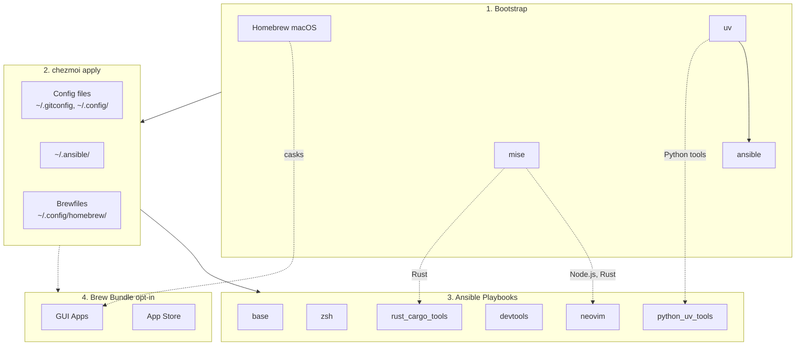

# dotfiles

Cross-platform development environment setup using **chezmoi** + **ansible**.

- **chezmoi**: manages config files (dotfiles)
- **ansible**: installs system dependencies and tools

## Prerequisites

- [chezmoi](https://www.chezmoi.io/install/)
- [uv](https://docs.astral.sh/uv/getting-started/installation/) (for ansible)

## Architecture



## Quick Setup

```bash
# One-liner to initialize and apply (installs chezmoi to ~/.local/bin)
export GITHUB_USERNAME=daviddwlee84
sh -c "$(curl -fsLS get.chezmoi.io)" -- -b "$HOME/.local/bin" init --apply git@github.com:$GITHUB_USERNAME/dotfiles.git
```

This automatically:

1. Bootstraps Homebrew (macOS/Linux), uv, mise, ansible
2. Deploys all config files
3. Runs ansible playbooks (git, ripgrep, fd, neovim, etc.)
4. Runs brew bundle (if `installBrewApps` enabled)

### Optional Components

During `chezmoi init`, you'll be prompted for optional installs:

| Option | Default | Description |
|--------|---------|-------------|
| `installCodingAgents` | true | Claude Code, OpenCode, Cursor, Copilot, Gemini CLI, etc. |
| `installBitwarden` | false | Bitwarden CLI (`bw`) + Desktop app (desktop profiles) with SSH agent auto-detection |
| `installPythonUvTools` | true | Python CLI tools via uv (mlflow, litellm, sqlit-tui, etc.) |
| `installBrewApps` | false | GUI apps via Homebrew Brewfile (casks, mas) |
| `noRoot` | false | Skip sudo-requiring tasks (for servers without root access) |

To change options later: `chezmoi init --force`

## What You Get

### Config Files

- `~/.gitconfig` - Git configuration
- `~/.config/nvim/` - Neovim (LazyVim) configuration
- `~/.config/uv/uv.toml` - uv package manager config
- `~/.cargo/config.toml` - Cargo registry mirror config (GFW)
- `~/.npmrc` - npm registry config (official/npmmirror via `useChineseMirror`)
- `~/.config/.bunfig.toml` - Bun global registry config (official/npmmirror via `useChineseMirror`)
- `~/.config/alacritty/` - Alacritty terminal config
- `~/.claude/` - Claude Code settings
- `~/.tmux.conf` - Tmux configuration with TPM plugins
- `~/.local/bin/x` - Cross-platform terminal wrapper for `copy` / `paste` / `open`
- `~/.config/zsh/tools/36_pueue.zsh` - Pueue queue summary helper (`pqsum`)
- `~/.config/zsh/tools/28_tldr.zsh` - `tldrf` helper with `TLDR_LANGUAGES` fallback order
- `~/.config/zsh/tools/95_bitwarden.zsh` - Bitwarden CLI completion + SSH agent socket auto-detection
- `~/.config/homebrew/` - Brewfiles for GUI apps (macOS casks + mas)

### Tools (via ansible)

- **Base**: git, curl, ripgrep, fd, just, build tools
- **Neovim**: >= 0.11.2 with LazyVim dependencies
- **LazyVim deps**: fzf, lazygit, tree-sitter-cli, Node.js
- **Coding Agents** (optional): Claude Code, Codex CLI, CodexBar, OpenCode, Cursor CLI, Copilot CLI, Gemini CLI, SpecStory, Happy, OpenChamber
- **Bitwarden** (optional): Bitwarden CLI (`bw`) via npm, Desktop app (snap/deb on Linux, cask on macOS) on desktop profiles, with zsh completion and SSH agent auto-detection
- **Docker**: OrbStack (macOS) or Docker Engine (Linux)
- **Cargo tools**: pueue (process queue manager)
- **GUI Apps** (macOS): terminals, editors, browsers, utilities via Brewfile

### Bootstrap (installed before ansible)
- **Homebrew** (macOS): Package manager for macOS
- **uv**: Python package manager for ansible
- **mise**: Runtime manager for Node.js and Rust (ensures latest versions)
- **Dev tools**: bat, eza, git-delta, tldr, thefuck, zoxide, direnv, yazi, tmux+tpm, zellij, btop, htop
- **NerdFonts**: Hack Nerd Font for terminal emulators

## Supported Platforms

| Platform | Package Manager | Notes |
|----------|-----------------|-------|
| macOS | Homebrew | Full support |
| Ubuntu Desktop | apt + snap | Full support |
| Ubuntu Server | apt + snap | Full support |
| Ubuntu Server (no root) | GitHub binaries + mise + cargo + uv | `noRoot=true`, tools installed to `~/.local/bin` |

## Manual Commands

```bash
chezmoi diff          # Preview changes
chezmoi apply         # Apply config files
chezmoi cd            # Go to source directory

# Re-run ansible manually
cd ~/.ansible && ansible-playbook playbooks/macos.yml
```

## Docker Testing

Test the full dotfiles setup on a bare Ubuntu machine:

```bash
# Build and run test suite
just docker-test

# Interactive devbox shell
just docker-run

# Build specific profiles
just docker-desktop    # Ubuntu desktop profile
just docker-china      # China mirror profile
```

## Development with justfile

This project uses [just](https://github.com/casey/just) as a command runner:

```bash
just                  # List all commands
just lint             # Ansible syntax check
just check            # Full lint + dry-run
just docker-build     # Build Docker image
just info             # Show system info
```

## Customization

See [CLAUDE.md](CLAUDE.md) for development guide and [docs/ansible.md](docs/ansible.md) for ansible customization.
